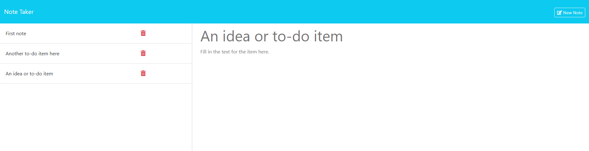

# 11-Challenge-Note-Taker

        
## Description
            
This project is a note taking application built using the back-end Javascript development framework [Express.js](https://expressjs.com/) and deployed at a live website via [Render](https://render.com/).

I built this application as a way to store to-do items or other important notes a user may want to keep saved for future reference. As all notes are saved server-side in a .json file, the user can easily recall back their information at a later date or add new items. 

By completing this project, I expanded my knowledge of how to use the Express.js framework and specific HTTP methods to obtain, store and save data in my own created API. 

### Screenshot of application:

The screenshot below shows the front-end of the application with several notes saved.

The screenshot also shows how the most recent note titled: "An idea or to-do item", has been clicked on the left panel and has its details expanded on the right. 
            
## Table of Contents
            
- [Installation](#installation)
- [Usage](#usage)
- [License](#license)
- [Contributing](#contributing)
- [Tests](#tests)
- [Questions](#questions)
            
## Installation

There is no installation required if you want to access the deployed application via Render which is available here:
https://isaac-fallon-11-challenge-note-taker.onrender.com

However, if you'd prefer to run the program locally, you can do so by following these steps:

1. Clone the repository to your local machine. [Refer to this guide from GitHub if you need help.](https://docs.github.com/en/repositories/creating-and-managing-repositories/cloning-a-repository/)

2. Once cloned, you will need to navigate to the project's folder in your terminal and run the command: 'npm install' to install the necessary dependencies. 

3. While still in the project's folder in your terminal, enter the command: 'npm start' to run the application locally.

4. In your browser of choice, navigate to the following URL: 'http://localhost:3001/' which should show the index.html landing page. 
            
## Usage

To use the application, visit the deployed link hosted on Render:

https://isaac-fallon-11-challenge-note-taker.onrender.com
            
## License
            
MIT License

Copyright (c) 2024 isaacfallon
            
Permission is hereby granted, free of charge, to any person obtaining a copy
of this software and associated documentation files (the "Software"), to deal
in the Software without restriction, including without limitation the rights
to use, copy, modify, merge, publish, distribute, sublicense, and/or sell
copies of the Software, and to permit persons to whom the Software is
furnished to do so, subject to the following conditions:
            
The above copyright notice and this permission notice shall be included in all
copies or substantial portions of the Software.
            
THE SOFTWARE IS PROVIDED "AS IS", WITHOUT WARRANTY OF ANY KIND, EXPRESS OR
IMPLIED, INCLUDING BUT NOT LIMITED TO THE WARRANTIES OF MERCHANTABILITY,
FITNESS FOR A PARTICULAR PURPOSE AND NONINFRINGEMENT. IN NO EVENT SHALL THE
AUTHORS OR COPYRIGHT HOLDERS BE LIABLE FOR ANY CLAIM, DAMAGES OR OTHER
LIABILITY, WHETHER IN AN ACTION OF CONTRACT, TORT OR OTHERWISE, ARISING FROM,
OUT OF OR IN CONNECTION WITH THE SOFTWARE OR THE USE OR OTHER DEALINGS IN THE
SOFTWARE.
            
## Contributing

The ['fsUtils'](./helpers/fsUtils.js) file located within the 'helpers' folder in this repository was referenced from the week 11 mini-project file created by The University of Sydney's Coding Bootcamp program. While I've made very slight changes, the overall design and structure is mostly taken from the  Bootcamp program. 

All code in this file belongs to the programers responsible for setting up these bootcamp modules. 
            
## Tests

N/A
     
## Questions
            
If you have any questions, please reach out at either of the following:
            
### GitHub profile:
- https://github.com/isaacfallon

### Email:
- isaac.fallon@gmail.com